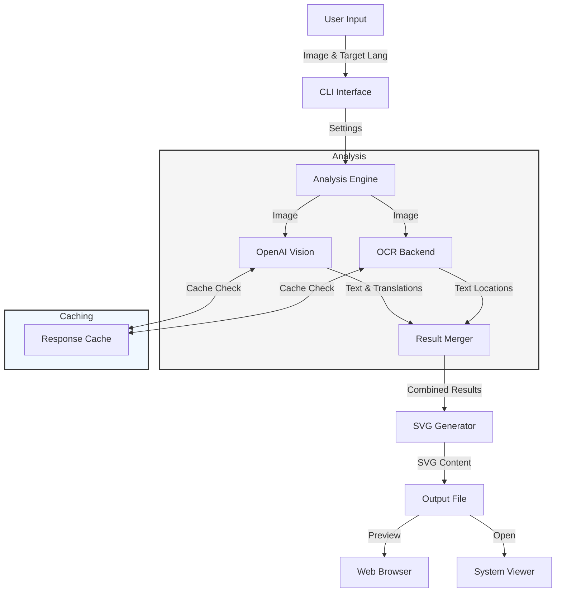
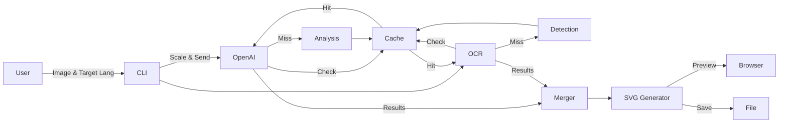

# Labelingo Design Document

## Overview

Labelingo is a tool for annotating UI screenshots with translations. It combines OCR (Optical Character Recognition) with AI-powered translation to create annotated SVG files that show both the original text and its translation.

## Architecture

The system consists of four main components:

1. CLI Interface (`cli.py`)
2. OCR and Analysis Engine (`ocr.py`)
3. SVG Annotation Generator (`annotator.py`)
4. Utilities and Caching (`utils.py`, `response_cache.py`)

### Component Details

#### CLI Interface
- Handles command-line arguments and configuration
- Manages the workflow between components
- Provides options for output format and preview

#### OCR and Analysis Engine
Supports multiple backends for text detection:

1. **OpenAI Vision API**
   - Primary source for translations
   - Provides source language detection
   - Image preprocessing:
     - Scales images to max 2048px
     - Optimizes JPEG quality
   - Uses structured output format
   - Results are cached based on image content and analysis parameters

2. **OCR Backends**
   - Claude Vision API (default)
   - Tesseract OCR
   - EasyOCR
   - PaddleOCR
   - Each provides text location and content
   - Results are combined with OpenAI translations

#### SVG Annotation Generator
- Creates interactive SVG output
- Features:
  - Original screenshot as background
  - Bounding boxes around detected text
  - Curved connector lines
  - Numbered annotations with translations
  - Responsive scaling

#### Caching System
- Caches API responses to reduce costs and latency
- Cache keys include:
  - API endpoint
  - Image content hash
  - Schema/structure hash
  - Target language

## Data Flow

1. User provides screenshot and target language
2. Image is preprocessed and scaled
3. OpenAI Vision analyzes for text and translations
4. Selected OCR backend processes for text locations
5. Results are merged:
   - OCR provides text locations
   - OpenAI provides translations
6. SVG generator creates annotated output
7. Result is displayed or saved

## Design Decisions

### Image Processing
- Max dimension of 2048px balances API costs with accuracy
- JPEG quality of 85% optimizes size vs. quality
- Lanczos resampling for best text clarity

### Caching Strategy
- Comprehensive cache keys prevent redundant API calls
- Schema versioning handles API changes
- File-based cache for persistence

### Translation Workflow
1. OpenAI Vision provides initial analysis
2. OCR backend provides precise text locations
3. Results are merged prioritizing:
   - OCR for text locations
   - OpenAI for translations
   - Source language detection

### Error Handling
- Graceful fallbacks for missing dependencies
- Clear error messages for API issues
- Debug mode for troubleshooting

### Label Placement Strategy

The SVG annotator uses intelligent label placement to improve readability and utilize space efficiently:

1. **Margin Calculation**
   - Margins are calculated dynamically based on label content
   - Left margin: width of longest left-side label + 60px padding
   - Right margin: width of longest right-side label + 60px padding
   - Image centered between margins

2. **Label Distribution**
   - For elements with bounding boxes:
     - Elements in left half → labels on left
     - Elements in right half → labels on right
   - For elements without bounding boxes:
     - Alternates between left and right sides
     - Placed at bottom of respective sides
     - Uses bullet points (•) instead of numbers

3. **Vertical Positioning**
   - Labels are sorted by their corresponding element's y-position
   - Minimum vertical spacing of 25px between labels
   - Labels without bounding boxes placed at bottom
   - Each side (left/right) tracks its last y-position to prevent overlap

4. **Connector Lines**
   - White outline (4px) with colored center line (2px)
   - Curved Bézier paths with rounded line caps
   - For right-side labels:
     - Connects from 20px left of label to right edge of element box
   - For left-side labels:
     - Connects from start of label to left edge of element box

5. **Visual Elements**
   - Rounded rectangles (6px radius) around detected UI elements
   - 4px padding around detected element bounds
   - White background behind labels to ensure readability
   - Text padding of 5px around labels
   - Consistent font family (Helvetica Neue/Arial) with defined sizes:
     - Numbers: 16px
     - Text: 15px
     - Title: 20px

This approach provides:
- Clean, consistent layout
- Clear visual connection between labels and elements
- Optimal space utilization
- Improved readability through careful spacing and typography
- Graceful handling of elements without detected bounds

## Future Improvements

1. **Parallel Processing**
   - Concurrent API calls for faster processing
   - Batch processing for multiple images

2. **UI Improvements**
   - Interactive web interface
   - Real-time preview
   - Custom annotation styles

3. **Enhanced Analysis**
   - Context-aware translations
   - UI element type detection
   - Alternative translation services

4. **Output Formats**
   - PDF export
   - HTML with interactive features
   - Translation memory export

## Dependencies

Core:
- click: CLI interface
- Pillow: Image processing
- anthropic: Claude API
- openai: OpenAI Vision API
- python-dotenv: Configuration

Optional (OCR):
- pytesseract
- easyocr
- paddleocr
- paddlepaddle

## Configuration

The system uses environment variables for API keys:
- `ANTHROPIC_API_KEY`: For Claude Vision API
- `OPENAI_API_KEY`: For OpenAI Vision API

These can be set in the environment or in a `.env` file.
